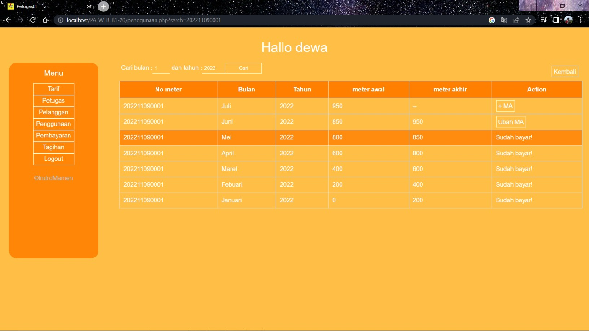

<h1> PA WEB B1'20 KELOMPOK 7 </h1>
<h1> Indro Dwi Saputro 2009106099 </h1>

<h1>Website Tagihan PLN </h1>

<h3>Asisten Lab<h3>
<b>Kandika Prima Putra(1915016015)    & Delfan Rynaldo Laden(1915016069)</b>

-
<h3>Kebutuhan Fungsional Sistem<h3>

<ul>
<li>Pelanggan dapat melihat Tagihan dan Penggunaan</li>
<li>Petugas Dapat Melakukan Login</li>
<li>Petugas dibagi menggunakan level(Multiuser)</li>
<li>Petugas bisa CRUD Tarif</li>
<li>Petugas dapat melihat data petugas lainnya</li>
<li>Petugas dengan level tertentu bisa menambahkan atau menonaktifkan petugas lainnya</li>
<li>Petugas dapat CRUD data pelanggan dan dapat melihat data pelanggan yang No Meter nya Mati</li>
<li>Petugas dengan level tertentu dapat melihat data penggunaan pelanggan dan menambahkan meter akhir pelanggan</li>
<li>Petugas dengan level tertentu dapat mengelola data pembayaran pelanggan dan melihat history pembayaran</li>
<li>Petugas dengan level tertentu dapat melihat data tagihan dari pelanggan</li>
<li>Petugas bisa logout</li></ul>

<h3>Kebutuhan Non Fungsional</h3>

<ul>
<li>Sistem berbasis Web</li>
<li>Dapat dijalankan pada OS minimal ram 1 GB</li>
<li>Minimum perangkat menggunakan windows 7</li>
<li>Google Chrome sebagai browser</li>
<li>Pelatihan Petugas agar memahami fitur yang ada melalui manual book</li>
</ul>

<h3>Perancangan</h3>
<h5>ERD</h5>

<h3>Tentang Website</h3>

Website tagihan PLN ini merupakan sebuah website untuk mengelola dan melakukan transaksi pembayaran tagihan PLN.
Website ini mampu melihat data tagihan dan penggunaan bagi pelanggan dan mengelola data tarif, petugas, pelanggan,
penggunaan, pembayaran dan tagihan.

<h3>Cara Penggunaan Website</h3>

Berikut cara penggunaan aplikasi website tagihan PLN, mulai dari pemakaian untuk pelanggan dan petugas.

<h4>Fitur-fitur yang ada untuk pelanggan</h4>
<ul>
<li>Tampilan Untuk Pelanggan</li>

 Pelanggan dapat melihat data tagihan dan penggunaan dengan menginputkan no meter, lalu ada info tentang PLN, Kotak Saran
dan Kontak Kami

<li>Cek Tagihan Dan Penggunaan</li>

Pelanggan menginputkan no meter, lalu tekan cari dan website akan menampilkan data tagihan dan penggunaan pelanggan sesuai dengan
no meter yang di input

<li>Info</li>

Pelanggan dapat melihat informasi tentang PLN

<li>Saran</li>

Pelanggan dapat memberikan saran terhadap petugas Website

<li>Kontak</li>

Pelanggan dapat melihat Kontak dari Admin Website

</ul>

<h4>Fitur-fitur Petugas</h4>
<ul>
<li>Login</li>

 Sebelum dapat megakses fitur-fitur untuk mengelola data, petugas diharuskan untuk login terlebih dahulu,
fitur yang dapat diakses oleh petugas dibatasi dengan level dari setiap petugas

<li>Halaman Petugas</li>

Disini menampilkan fitur-fitur apa saja yang dapat diakses oleh petugas yang di batasi oleh level dari petugas

<li>Menu Tarif</li>

Disini Menampilkan data tarif dan terdapat fitur untuk menambah, mengubah dan menghapus data tarif

<li>Tambah Tarif</li>

Ini adalah form untuk menambahkan tarif baru dengan memasukkan daya dan tarif baru

<li>Update Tarif</li>

Ini adalah form untuk megubah data tarif yang telah di input, dengan memasukkan daya atau tarif terbaru yang ingin kita ubah maka tarif akan terubah

<li>Hapus Tarif</li>

Ini adalah tampilan ketika kita ingin menghapus data tarif, konfirmasi dahulu apakah benar kita ingin menghapus data tarif

<li>Menu Petugas</li>

Disini Menampilkan data petugas dan terdapat fitur untuk menambah, mengubah dan menon/aktifkan data petugas

<li>Tambah Petugas</li>

Ini adalah form untuk menambahkan petugas baru dengan memasukkan Username, Password, Nama File(gambar), File gambar(foto petugas), Tugas

<li>Update Petugas</li>

Ini adalah form untuk menambahkan petugas baru dengan memasukkan Username, Password, Nama File(gambar), File gambar(foto petugas), Tugas baru yang ingin di update

<li>Non/Aktifkan Petugas</li>

Ini adalah tampilan ketika kita ingin menon/aktifkan data petugas, konfirmasi dahulu apakah benar kita ingin menon/aktifkan data petugas

<li>Menu Pelanggan</li>

Disini Menampilkan data pelanggan dan terdapat fitur untuk menambah, mengubah, menghapus dan melihat nomor meter yang mati

<li>Tambah pelanggan</li>

Ini adalah form untuk menambahkan pelanggan baru dengan memasukkan nama, alamat, nomor telpon dan tarif

<li>Update pelanggan</li>

Ini adalah form untuk menambahkan pelanggan baru dengan memasukkan nama, alamat, nomor telpon dan tarif baru yang ingin di update

<li>Hapus pelanggan</li>

Ini adalah tampilan ketika kita ingin Menghapus data pelanggan, konfirmasi dahulu apakah benar kita ingin menon/aktifkan data pelanggan

<li>Menu Penggunaan</li>

Disini Menampilkan data penggunaan dengan memasukkan nomor meter yang ingin di cari, dan disini terdapat fitur untuk menambahkan meter akhir untuk memasukkan data penggunaan

<li>Tambah Meter Akhir</li>

Ini adalah form untuk menambahkan penggunaan baru dengan memasukkan meter akhir

<li>Update Meter Akhir</li>

Ini adalah form untuk menambahkan penggunaan baru dengan memasukkan meter akhir yang baru

<li>Menu Pembayaran</li>

Disini Menampilkan data pembayaran yang belum dibayar dengan memasukkan no meter yang ingin di cari serta dapat melakukan pembayaran dan print struk pembayaran

<li>Detail Pembayaran</li>

Ini adalah form untuk melakukan pembayaran, hanya admin dengan level tertentu dapat melakukan aksi ini, setelah menekan button bayar petugas akan di arahkan ke table history pembayaran dan dapat melakukan print

<li>History Pembayaran</li>

Ini adalah table yang menampilkan history pembayaran yang telah dilakukan

<li>Print</li>

Button prin dilakukan untuk aksi print struk pembayaran

<li>Menu Tagihan</li>

Ini adalah menu yang menampilkan data tagihan dari semua nomor meter yang berisikan no meter, nama, bulan, tahun, penggunaan dan status pembayaran

<li><h4>Menu logout</h4></li>

Jika menekan menu logout maka petugas akan langsung diarahkan kembali ke menu login
</ul>